::::Section[Контекст]

### О клиенте

Прошлой осенью мы познакомились с Натальей — харизматичной амбициозной женщиной, которая занимается продажей недвижимости напрямую от застройщиков юга России

Она рассказала нам, что создаёт компанию и ей нужен сайт. Но сайт должен не только предоставлять информацию о компании, а ещё помогать с продажей квартир

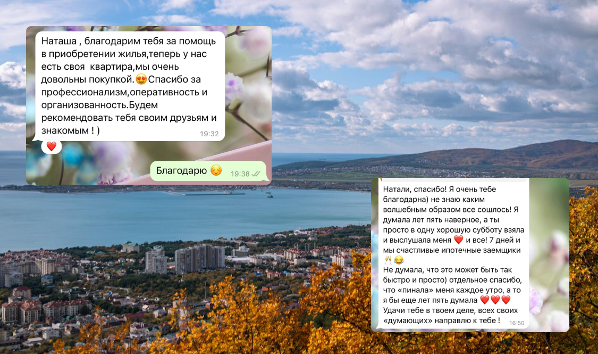

### Проблема

Основной канал продаж — WhatsApp. Наталье приходится каждый раз искать информацию и материалы в облаках застройщиков, чтобы рассказать покупателю про объект

Ещё у компании не было названия и брендинга — поэтому в процессе работы мы генерировали идеи вместе с Натальей

::::

::::Section[Понимание]

### Задачи

- Создать минимальный бренд для компании
- Создать агрегатор для подбора новостроек в Краснодаре

Бюджет и сроки были сильно ограничены, поэтому для начала мы остановились только на новостройках Краснодара

### Аудитория

- Cеверные регионы РФ
- 25–50 лет
- Есть дети
- Желают инвестировать деньги в недвижимость комфорт и бизнес класса
- Хотят, чтобы у детей в будущем было жилье около университета

### Цель для бизнеса

- Сократить время на презентацию объектов
- Увеличить узнаваемость компании

### Миссия для пользователя

Познакомить пользователя с новостройками и развеять страхи, которые не дают сделать первый шаг к покупке

### Критерии успеха

- Уменьшение времени на презентацию объектов
- Увеличение количества продаж

Сравним время на презентацию и количество продаж до запуска проекта, и в течение двух месяцев после запуска

::::

::::Section[Исследования]

### Анализ конкурентов

Сначала мы с Колей принялись анализировать сайты конкурентов, чтобы определить возможную структуру и наполнение нашего проекта

Пошли легким путем и выделили топ 5 застройщиков по мнению [ЕРЗ РФ](https://erzrf.ru/top-zastroyshchikov/rf?topType=2)

:::Note{icon='✨'}

**Да, получается разобрали только косвенных конкурентов**

Ещё нужно было смотреть другие агрегаторы недвижимости, но об этом вспомнили только на этапе разработки

:::

Затем в экселе выделили четыре листа для анализа:

- Главная страница
- Страница объектов
- Характеристики объектов
- Страница компании

И принялись разбирать сайты конкурентов по принципу: блок есть — «да», иначе — «нет»

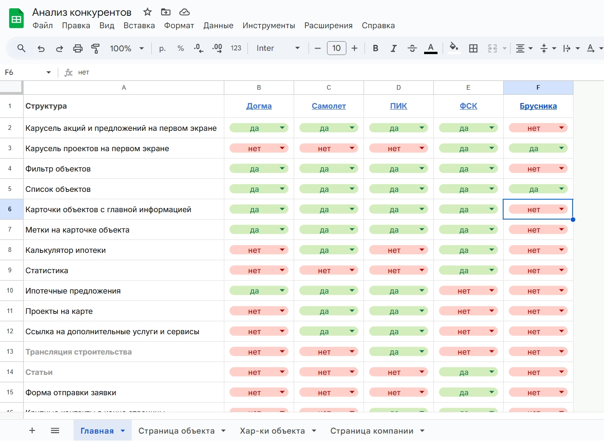

У нас сложилось примерное понимание, какая информация нужна, и мы набросали структуру страниц

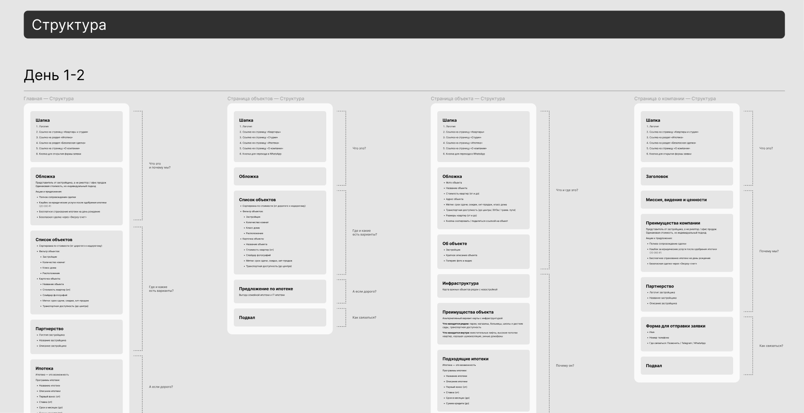

Дополнительно в фигме сохраняли скрины отдельных блоков и решений, которые показались нам интересными

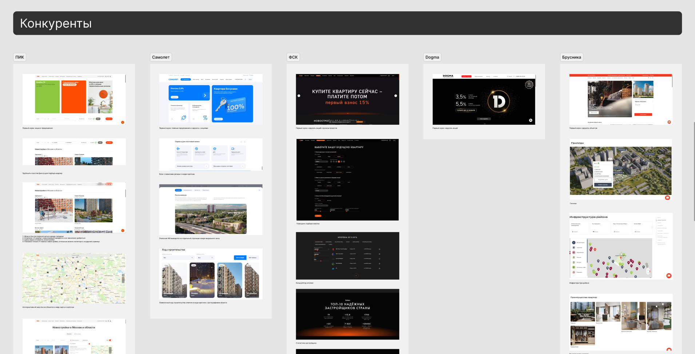

### Анализ страхов аудитории

Наталья из переписок с покупателями выделила страхи аудитории. То есть самые частые моменты, которые останавливают людей начать сделку

На каждый страх мы набросали гипотезы с возможным решением

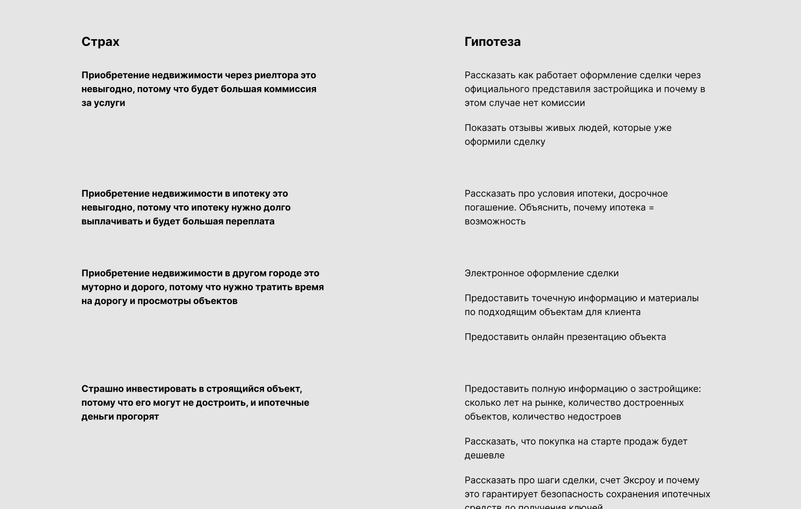

Так мы перетасовали блоки в структуре страниц, чтобы быть ближе к аудитории

### Анализ UX-статей

Я прочитал исследования от крупных застройщиков и других экспертов сферы, и выделил моменты, которые можно применить в рамках нашего проекта, например:

- обстановку и тенденции на рынке недвижки в 2024
- критерии при выборе жилья комфорт и бизнес класса в 2024
- что люди хотят видеть на странице объекта

### Итог

Как результат, мы подготовили прототипы страниц с набросками контента + лучше погрузились в задачу и сферу недвижимости

После мы обсудили прототипы с Натальей и довели их до ума

::::

::::Section[Концепция]

### О конкурентах

Наталья попросила выделить сайт среди конкурентов

Поэтому я начал концепцию с изучения первых экранов застройщиков юга России, и понял… что выделиться будет нетрудно

### Описание концепции

Дальше я собрал референсы и описал концепцию по 3-м столпам:

- `рост` — потому что говорим об инвестицииях
- `простота` — потому что говорим о сложной сфере
- `тепло` — потому что говорим о юге России

Процесс покупки недвижимости похож на крышу высотки, ведь с первого взгляда кажется, что они оба труднодостижимы

Мы проводим людей до лифта, который символизирует рост, быстрое и комфортное достижение цели

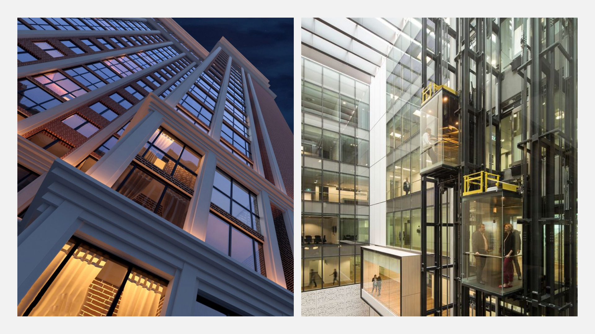

Наш мозг мысленно дорисовывает очертания объекта даже, если он состоит из набора несоединенных точек. Эта незавершенность имитирует строящуюся новостройку

<Video
	width={1920}
	height={1080}
	sources={[
		'./media/nova-ug/content/moodboard-2.jpg',
		'./media/nova-ug/content/moodboard-2.mp4',
		'./media/nova-ug/content/moodboard-2_h265.mp4',
	]}
	autoplay
	lazy
/>

Мы показываем, что покупка недвижимости — это не страшно. Проводим людей через факты, и они сами делают выводы

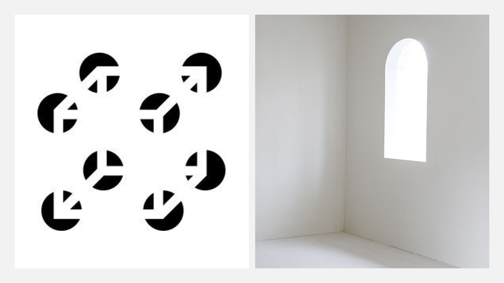

Ключевая идея концепции — индикатор лифта. Он объединяет идеи описанные выше и добавляют изюминку, которая привлекает внимание

Ещё смотря на него можно вспомнить старые игры: тетрис или тамагочи

<Video
	width={1920}
	height={1080}
	sources={[
		'./media/nova-ug/content/moodboard-4.jpg',
		'./media/nova-ug/content/moodboard-4.mp4',
		'./media/nova-ug/content/moodboard-4_h265.mp4',
	]}
	autoplay
	lazy
/>

Теплые оттенки передают уютную атмосферу юга России

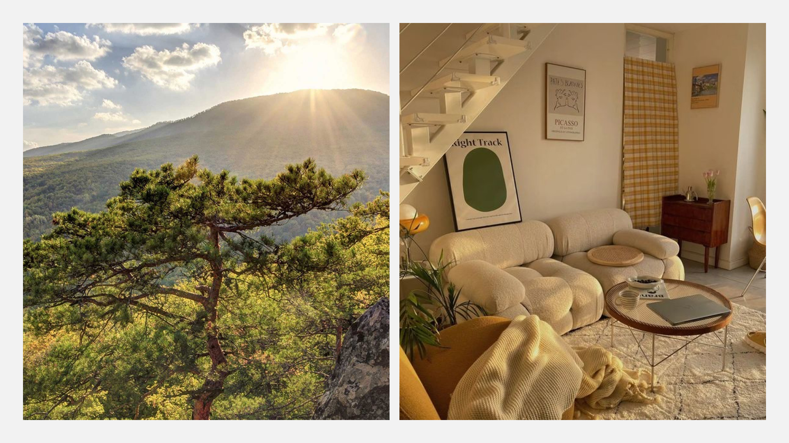

Затем я соединил референсы воедино, и сделал быстрый набросок, чтобы раскрыть идею концепции до конца

<Video
	width={1920}
	height={1080}
	sources={[
		'./media/nova-ug/content/moodboard-6.jpg',
		'./media/nova-ug/content/moodboard-6.mp4',
		'./media/nova-ug/content/moodboard-6_h265.mp4',
	]}
	title="Ещё сделал несколько вариантов анимации индикатора"
	autoplay
	lazy
/>

Дополнил концепцию логотипом, в котором переиспользовал идею

### Развитие концепции

Ура, Наталья приняла концепцию, но нужно решить два момента:

1. горизонтальный индикатор был непонятен
2. цвета не передавали всё тепло и яркость южных курортов

Я начал с цветов — собрал ещё референсов и набросал новые варианты, но результат меня всё равно не устраивал

Перебор цветов меня не привел к нужному результату, поэтому я экспериментировал с концепцией на других блоках

Баловался с расположением индикатора

Затем я подумал над атмосферой проекта, которую хочу достичь, и собрал ещё референсов

И в результате у меня получилось добиться простого и понятного варианта с акцентом на контенте

Он тоже больше понравился Наталье, поэтому остановились на нём

::::

::::Section[Дизайн]

### Главная

Дальше я принялся прорабатывать главную по принципу — быстренько набросал блок с текстом, расписал ощущения, улучшил

Самое трудное и интересное место концепции — пиксельные иконки, потому что через них нужно закрепить смысл текста

А это получалось далеко не с первого раза...

Кроме этого я придерживался одного стиля иконок и переиспользовал его между блоками

Самое крутое решение в рамках концепции — пиксельные анимации в начале и конце страницы, которые я создал покадрово

Возможно покажется безумным вставлять анимацию на первый экран, но есть особенность, благодаря которой она минимально повлияла на загрузку страницы

:::Note{icon='😏'}

**И даже была сверстана без помощи lottie-анимации**

В [разделе про фронтенд](#frontend) рассказал подробнее

:::

### Страница объекта

Теперь нужно уложить максимум информации в минимум блоков

При этом расписать их понятно и расположить по приоритету — здесь особенно помогли выводы из исследований

В тех блоках, где объем и качество контента у застройщиков сильно разнилось, я использовал простые по структуре решения

Из причинившего мне боль — при создании дизайна карты я опирался на решения крупных застройщиков

Но в моменте мы с Колей поняли, что на расстановку кастомных меток уйдет много времени и локации вокруг объекта часто обновляются

Поэтому мы решили упростить карту, а метки оставить стандартные

### Остальные страницы

Две самые объемные страницы были пройдены

На остальных я переиспользовал дизайн-решения для сохранения ресурсов

Затем проработал дизайн модальных окон

Так как мы будем собирать данные с помощью метрик, я ещё задизайнил попап для куки-файлов

### Адаптация под мобилки

Ресурсы ограничены, поэтому я адаптировал дизайн только под телефоны

В одних блоках — поменялось расположение

А другие — скрылись за выдвижной панелью

Так же адаптировал пиксельную анимацию

### Состояния для разработки

Заранее прописал логику и состояния, чтобы на этапе разработке сэкономить время

В некоторых местах делал дополнительные пометки:

- что происходит при нажатии
- как происходит сортировка
- скорость и стиль анимации

::::

::::Section[Материалы]

### UI-кит и иконки

Компоненты в разных стилях и состояниях, которые я переиспользовал на всех страницах по максимуму для экономии времени на разработку

Так же здесь я собрал интерфейсные и контентные иконки

Отдельно прописал правила для создания и экспорта анимации

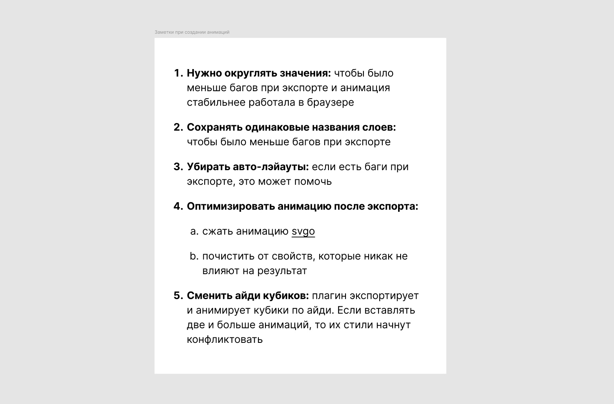

### Закадритор

Ещё в процессе работы я сделал мини-инструмент, который помогает кадрировать обложки объектов в едином формате

1. Вставляем фото в компонент
2. Смотрим всё ли ровно на странице и в карточке объекта
3. Экспортируем и отправляем в прод

::::

::::Section[Фронтенд]

### Технологии

Кроме базовых языков верстки при разработке я ещё использовал:

- [`Astro`](https://astro.build/) — статический фреймворк для генерации страниц
- [`Svelte`](https://svelte.dev/) — динамический фреймворк для фильтрации, карты и других интерактивных компонентов

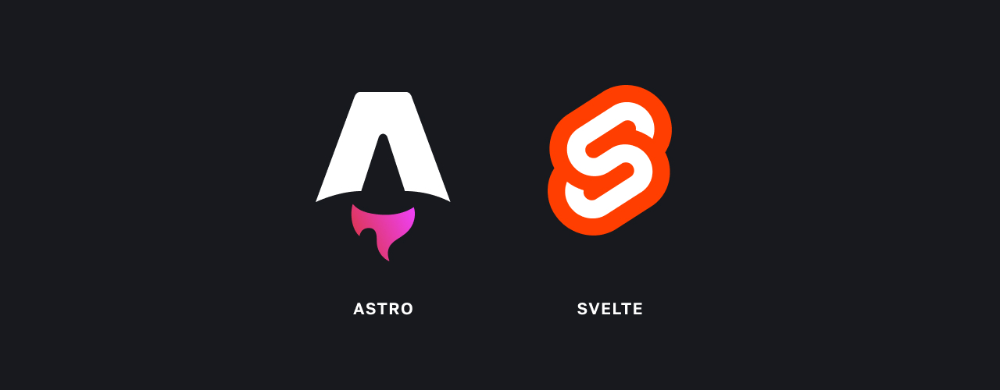

### Как сверстал анимацию

Никаких [lottie](https://lottiefiles.com/). Только css-анимации. Только хардкор.

Но если серьёзно, то я объединял покадровую анимацию в прототип, а затем экспортировал из Фигмы с помощью плагина

')

Анимации максимально примитивные, поэтому плагин спокойно с ними справлялся, и в результате генерировал мне svg и css-код

Я подправил несколько моментов и вуаля:

- идеальная четкость анимации, в отличие от видео и гифок
- сэкономил на первом экране пользователям ≈2 мб трафика, в сравнении с lottie

::::

::::Section[Бэкенд]

### Технологии

В рамках бэкенда Коля подключил и настроил Яндекс Метрику, и помог с настройкой скрипта для Яндекс Карт

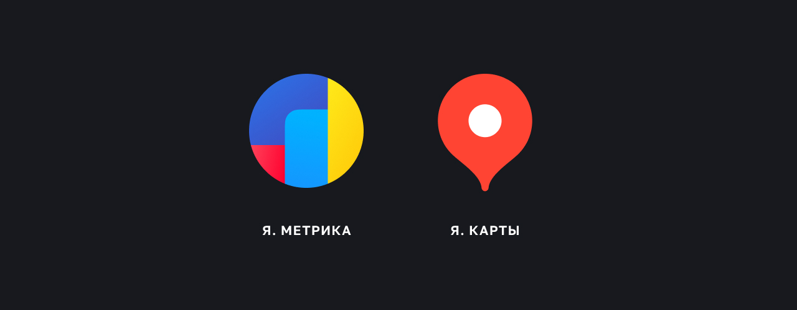

А ещё настроил телеграм-бот, который автоматически отправляет заявки с сайта в чат

### Коллекции контента

Ресурсов на аренду сервера, настройку CMS и базы данных — не было

На сайте всего 12 объектов, поэтому на первое время мы выбрали систему контент-коллекций в Astro

Идея простая:

1. создаем папку с коллекцией объектов
2. определяем схему коллекции
3. заполняем коллекцию контентом в формате markdown-файлов
4. берем из коллекций информацию для страниц и фронтенд-икомпонентов
5. билдим проект и получаем html-страницы под каждый объект, наполненные контентом

### Оптимизация

Чтобы мы могли фокусироваться на содержании контента, я подключил в проект автотипограф, который автоматически расставляет кавычки, тире, пробелы — всё по правилам русского языка

Картинок и видео на сайте много, поэтому вместе с Колей мы написали скрипт на питоне, который проходит по всем папкам и оптимизирует медиа с помощью [`ffmpeg`](https://www.ffmpeg.org/) и [`imagemagick`](https://imagemagick.org/)

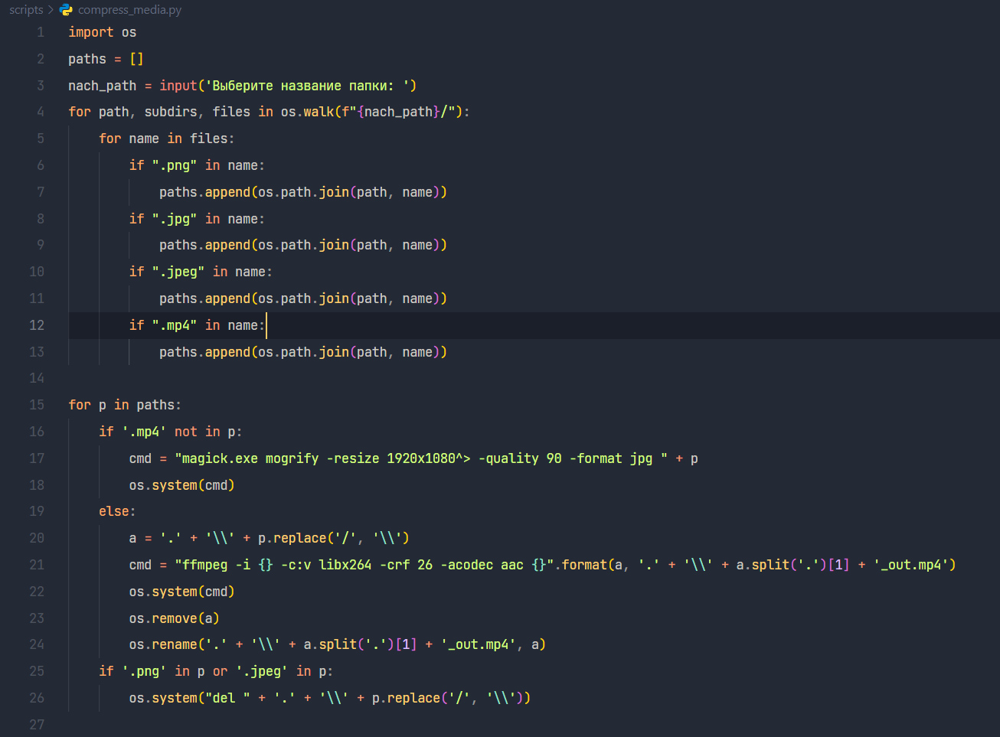

Всё это помогло существенно ускорить загрузку сайта, особенно в сравнении с сайтами крупных застройщиков России

::::

::::Section[Результаты]

### Чего добились

- Придумали название и стартовый брендинг для компании
- Разработали за месяц самый быстрый агрегатор недвижимости: скорость сайта на ≈54% выше по сравнению с сайтами конкурентов
- Организовали рабочее пространство для параллельной командной работы: пока я занимался дизайном и версткой, Коля собирал информацию и копирайтил объекты
- Поддерживали постоянную обратную связь: каждую неделю созванивались и делились прогрессом работы
- Адаптировались к нуждам проекта: прислушивались к идеям клиента и адаптировали проект
- Уложились в бюджет клиента и сохранили пространство для улучшений: в следующих итерациях на проект можно будет натянуть CMS и подключить полноценную базу данных за короткие сроки

<Video
	width={1920}
	height={1080}
	sources={[
		'./media/nova-ug/content/result.jpg',
		'./media/nova-ug/content/result.mp4',
		'./media/nova-ug/content/result_h265.mp4',
	]}
	title="Призыв к действию в конце страницы"
	autoplay
	lazy
/>

### Рефлексия

:::Note{icon="💚"}

**Работать над проектом мне понравилось**

Я глубже разобрался в брендинге и сфере недвижимости, и достиг результата даже при высокой степени неопределенности

:::

:::Note{icon="🎯"}

**Поставленной цели достичь не удалось**

Спустя 4 месяца после запуска я написал Наталье

Проблема: информация быстро теряет актуальность, поэтому проект сокращал время презентации только полтора месяца

Возможное решение: в следующей версии мы подключим CMS к проекту, чтобы можно было проще и быстрее обновлять информацию

:::

### Ссылки

:::List

<Card name="Посмотреть сайт" href={frontmatter.result} />

:::

::::
