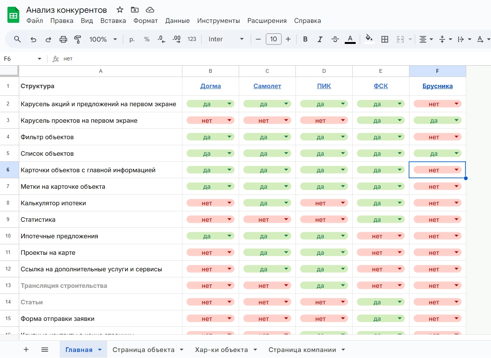
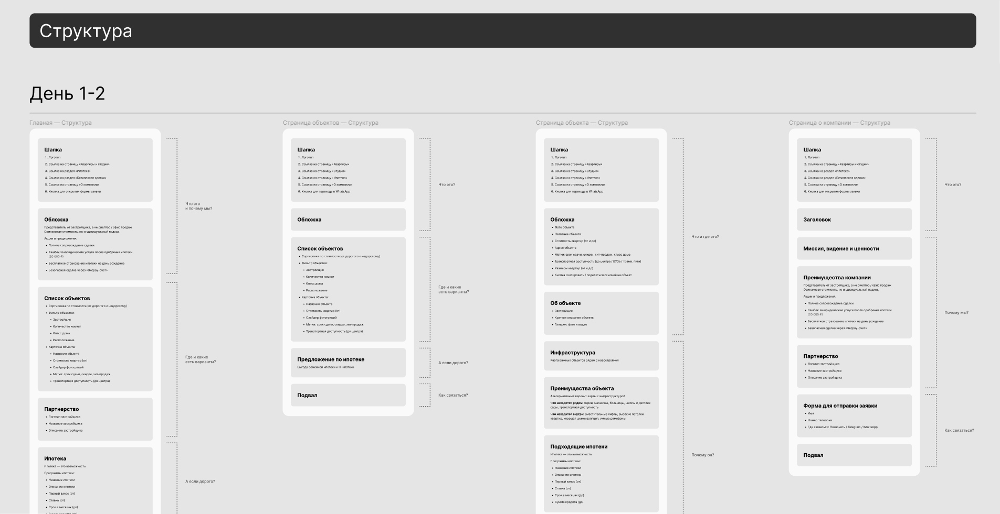
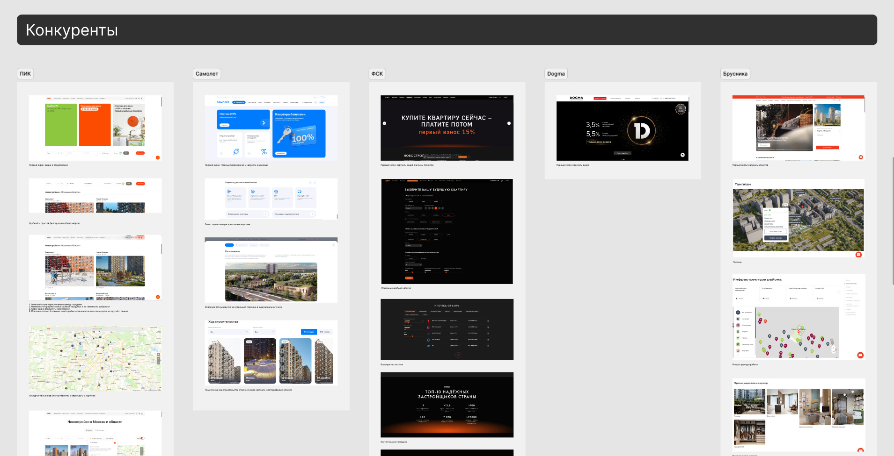
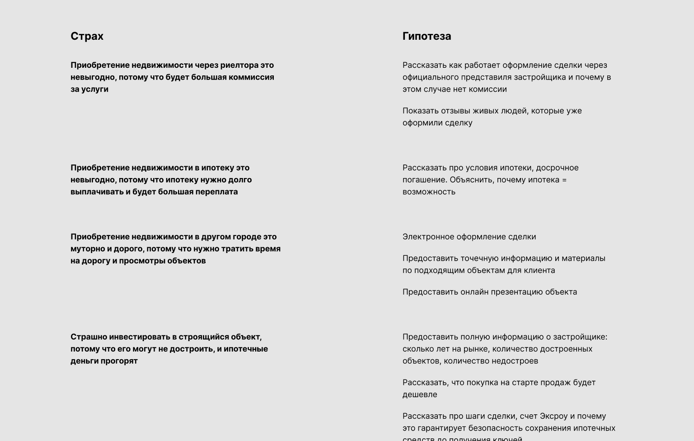
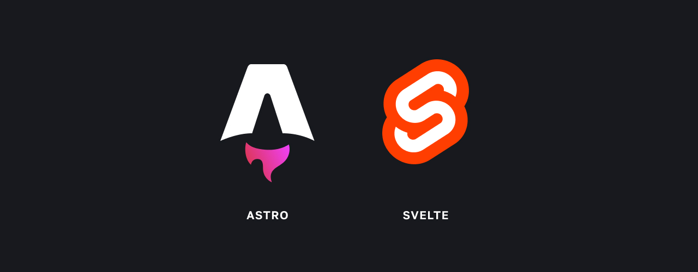
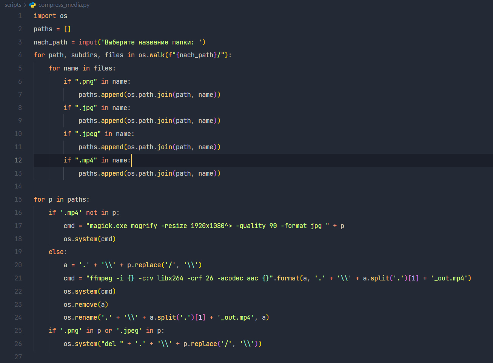

::::Section[Контекст]

### О клиенте

Прошлой осенью мы познакомились с Натальей — харизматичной амбициозной женщиной, которая занимается продажей недвижимости напрямую от застройщиков юга России

Она рассказала нам, что создаёт компанию и ей нужен сайт. Но сайт должен не только предоставлять информацию о компании, а ещё помогать с презентацией объектов

### Проблема

Основной канал продаж — WhatsApp

Наталье приходится каждый раз искать информацию в облаках застройщиков, чтобы рассказать покупателю про объект

Покупателю же приходится ориентироваться в пачке сообщений и забивать медиафайлами своё устройство

### Гипотеза

Если мы создадим сайт-агретатор новостроек, где структурируем информацию об объектах в едином формате, то это поможет Наталье быстрее презентовать объект, а покупателю принять решение о покупке квартиры

::::

::::Section[Понимание]

### Задача

Создать агрегатор для подбора новостроек в Краснодаре

:::Note{icon='✨'}

Бюджет и сроки были сильно ограничены, поэтому для начала мы остановились только на новостройках Краснодара

:::

### Аудитория

Жители северных регионов РФ, возрастом 25–50 лет, которые:

- желают инвестировать деньги в недвижимость комфорт и бизнес класса
- хотят, чтобы у детей в будущем было жилье около университета

### Цель для бизнеса

- Увеличить количество продаж
- Повысить лояльность к компании

### Миссия для пользователя

Помочь быстрее купить квартиру в новостройке и развеять страхи

### Критерий успеха

Уменьшение времени на презентацию через 2 месяца после запуска проекта

::::

::::Section[Исследования]

### Бенчмаркинг

Сначала мы с Колей принялись анализировать сайты конкурентов, чтобы определить возможную структуру и наполнение нашего проекта

Пошли легким путем и выделили топ 5 застройщиков по мнению [ЕРЗ РФ](https://erzrf.ru/top-zastroyshchikov/rf?topType=2)

:::Note{icon='🥴'}

**Да, получается разобрали только косвенных конкурентов**

Ещё нужно было смотреть другие агрегаторы недвижимости, но об этом вспомнили только на этапе разработки

:::

И принялись разбирать сайты конкурентов по принципу: блок есть — «да», иначе — «нет»

У нас сложилось примерное понимание, какая информация нужна, и мы набросали структуру страниц

Дополнительно в фигме сохраняли скрины отдельных блоков и решений, которые показались нам интересными

### Анализ страхов аудитории

Наталья из переписок с покупателями выделила страхи аудитории. То есть самые частые моменты, которые останавливают людей начать сделку

На каждый страх мы набросали гипотезы с возможным решением

Так мы перетасовали блоки в структуре страниц, чтобы быть ближе к аудитории

### Анализ рынка

Я прочитал исследования от крупных застройщиков и других экспертов рынка, и выделил моменты, которые нужно учитывать при создании дизайна:

- обстановку и тенденции на рынке недвижки в 2024
- критерии при выборе жилья комфорт и бизнес класса в 2024
- что люди хотят видеть на странице объекта

### Итог

Как результат, мы подготовили прототипы страниц с набросками контента + лучше погрузились в задачу и сферу недвижимости

После мы обсудили прототипы с Натальей и довели их до ума

::::

::::Section[Дизайн]

### Главная

Дальше я перешел к дизайну и принялся прорабатывать его по принципу:

Набросал блок -> Провел коридорное тестирование -> Улучшил

Кроме этого я переиспользовал дизайн-решения между блоками:

- единый стиль иконок
- единая структура блока из заголовка, акцента и описания к нему
- единый размер шрифтов

Так же я задизайнил анимацию в начале и конце страницы, чтобы зацепить пользователя

### Страница объекта

На этой странице нужно уложить максимум информации в минимум блоков

При этом расписать её понятно и расположить по приоритету — здесь особенно помогли выводы из исследований

В тех блоках, где объем и качество контента у застройщиков сильно разнилось, я использовал простые по структуре решения

Чтобы пользователь мог ознакомиться с локацией и инфраструкторой вокруг объекта, я добавил интерактивную карту

### Остальные страницы

На остальных страницах я переиспользовал блоки для сохранения ресурсов

Так же проработал дизайн модальных окон

### Адаптация под мобилки

Ресурсы были ограничены, поэтому я проботал адаптировный дизайн только для телефонов

В одних блоках — поменялось расположение контента

А другие — скрылись за выдвижной панелью. Например, фильтров в перспективе планируется больше, поэтому я их скрыл

### Состояния для разработки

Заранее прописал логику и состояния, чтобы на этапе разработке сэконномить время

В некоторых местах делал дополнительные пометки:

- что происходит при нажатии
- как происходит сортировка
- скорость и стиль анимации

::::

::::Section[Материалы]

### UI-кит

Компоненты в разных стилях и состояниях, которые я переиспользовал на всех страницах по максимуму для экономии времени на разработку

### Мини-инструмент

Ещё в процессе работы я сделал мини-инструмент, который помогает кадрировать обложки объектов в едином формате

1. Вставляем фото в компонент
2. Смотрим всё ли ровно на странице и в карточке объекта
3. Экспортируем и отправляем в прод

::::

::::Section[Разработка]

### Фронтенд

Кроме базовых языков верстки при разработке я ещё использовал:

- [`Astro`](https://astro.build/) — статический фреймворк для генерации страниц
- [`Svelte`](https://svelte.dev/) — динамический фреймворк для фильтрации, карты и других интерактивных компонентов

### Бэкенд

Чтобы мы могли фокусироваться на содержании контента, я подключил в проект автотипограф, который автоматически расставляет кавычки, тире, пробелы — всё по правилам русского языка

Картинок и видео на сайте много, поэтому вместе с Колей мы написали скрипт на питоне, который проходит по всем папкам и оптимизирует медиа с помощью [`ffmpeg`](https://www.ffmpeg.org/) и [`imagemagick`](https://imagemagick.org/)

Всё это помогло существенно ускорить загрузку сайта, особенно в сравнении с сайтами крупных застройщиков России

::::

::::Section[Результаты]

### Чего добился

- Стандартизировал разрозненный контент от 12 застройщиков, что ускорило презентацию объектов в 2 раза
- Разработал за 1.5 месяца самый быстрый агрегатор недвижимости: скорость загрузки страниц на ≈35% выше по сравнению с конкурентами
- Провёл бенчмаркинг конкурентов и рынка, чтобы применить лучшие практики
- Итеративно развил адаптивный дизайн и базовый брендинг, который выделил продукт среди конкурентов
- Провёл коридорные тестирования, что позволило устранить ключевые проблемы в юзабилити
- Разработал UI-кит, что помогло сохранить консистентность интерфейсов и ускорить их разработку

<Video
	width={1920}
	height={1080}
	sources={[
		'./media/nova-ug/content/result.jpg',
		'./media/nova-ug/content/result.mp4',
		'./media/nova-ug/content/result_h265.mp4',
	]}
	title="Призыв к действию в конце страницы"
	autoplay
	lazy
/>

### Мини-рефлексия

:::Note{icon="💚"}

**Работать над проектом мне понравилось**

Я глубже разобрался в сфере недвижимости, и достиг результата даже при высокой степени неопределенности

:::

### Ссылки

:::List

<Card name="Посмотреть сайт" href={frontmatter.result} />

:::

::::
