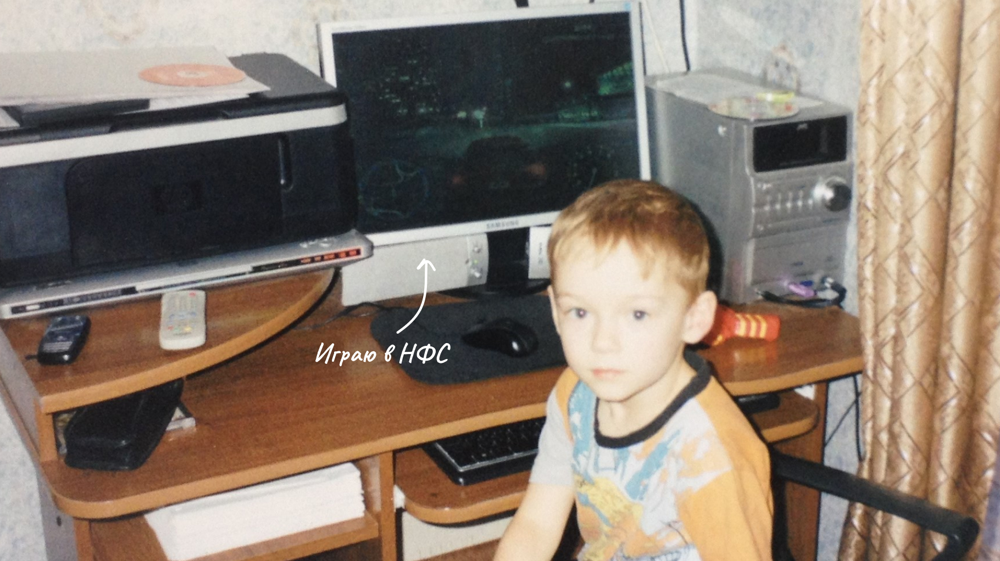
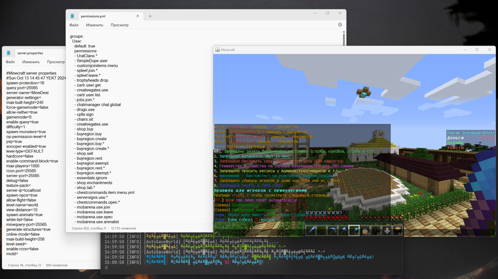

{/* импорты */}

import ContentSection from '@/components/organisms/ContentSection.astro'
import AboutCard from '@/components/molecules/AboutCard.astro'
import Image from '@/components/atoms/Image.astro'
import H3 from '@/components/atoms/H3.astro'
import Link from '@/components/atoms/ButtonLink.astro'
import aboutVideoCover from './media/about-cover.jpg'
import aboutVideoMP4 from './media/about-video.mp4'
import aboutVideoWEBM from './media/about-video.webm'

export const components = { img: Image, h3: H3, a: Link }

{/* контент */}

<ContentSection title="Визитка">

  <AboutCard mp4={aboutVideoMP4} webm={aboutVideoWEBM} poster={aboutVideoCover} />

  ---

  ### Что мне нравится

  - Систематизировать данные
  - Решать задачи с высокой степенью неопределенности
  - Работать с доступностью интерфейсов

  ### Скиллы

  - Самостоятельный
  - Проактивный
  - Мыслю системно и креативно
  - Решаю задачи с высокой степенью неопределенности
  - Говорю на одном языке с разработкой
  - Эмпатичный
  - Понимаю важность доступности
  - Умею брать ответственность
  - Умею слушать и слышать команду
  - Понимаю ценности исследований

</ContentSection>

<ContentSection title="История">
  ### Раннее детство

  С детства я любил разбираться, как устроена техника. В 3 года родители показали мне компьютер и это открыло для меня новый мир увлечений

  <figure>
    
    <figcaption>Меня застали в расплох за игрой в Need for Speed: Undeground 2</figcaption>
  </figure>

  Я много играл в Майнкрафт. Особенно мне нравились технические моды, где нужно было создавать схемы из механизмов и автоматизировать их. Это научило меня мыслить системно

  <figure>
    
    <figcaption>Автодобыча дерева, центр переработки руд, и водяная мельница</figcaption>
  </figure>

  Ещё мне нравилось играть на серверах, и я захотел создать свой. Проявив упорство, я смог это сделать. Так я впервые познакомился с программированием

  <figure>
    
    <figcaption>Так выглядело создание и настройка простого сервера</figcaption>
  </figure>

  ### Верстка

  Игры это круто, но в 9 классе я задумался о том, кем стану в будущем. Тогда я вспомнил, что раньше мне нравилось баловаться с созданием сайтов на конструкторах

  <figure>
    
    <figcaption>Новостной проект по майнкрафту, который я так и недоделал на WiX в 2016</figcaption>
  </figure>

  Я захотел копнуть глубже и узнать, как сайты устроены изнутри. Cледующие 2 года я учил языки верстки и практиковал хорошие практики

  <figure>
    
    <figcaption>Проект [интернет-магазина](https://sonniydsgn.github.io/bouncer/), который я сверстал в 2021</figcaption>
  </figure>

  Постепенно я начал понимать, что в наших реалиях одной верстки мало, и нужно выбирать, куда двигаться дальше: Фронтенд, Бэкенд или…

  ### Дизайн

  Я выбрал его, потому что в верстке мне больше всего нравилось систематизировать информацию по блокам с помощью HTML, а затем стилизовать её через CSS. Ещё в душе горела творческая нотка и желание сделать понятно

  Три года я учился дизайну: смотрел видео, читал статьи и книги, упорно практиковался

  <figure>
    
    <figcaption>Главный экран сайта для криптовалютного стартапа. Первый опыт в дизайне. 2021</figcaption>
  </figure>

  За время развития мы с другом создали [платформу для обмена рецептами блюд](/projects/mamayapovar) и выиграли всероссийскую олимпиаду. Потом нашли первых клиентов и разработали проекты в сферах [medtech](/projects/vtour) и [proptech](/projects/nova-ug)

  <figure>
    
    <figcaption>Главный экран [агрегатора новостроек](/projects/nova-ug) в Краснодаре. Один из последних дизайнов. 2024</figcaption>
  </figure>

  Во всех проектах я отвечал за менеджмент, дизайн и фронтенд. Изучал новые инструменты и оптимизировал процессы, чтобы мы работали быстрее

  <figure>
    
    <figcaption>Бэклог на 9 спринте во время разработки [Путеводителя по клинике](/projects/vtour)</figcaption>
  </figure>

</ContentSection>
