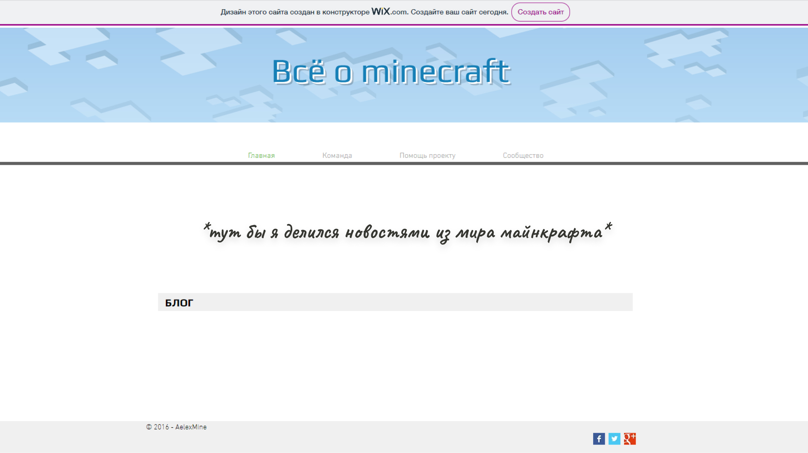
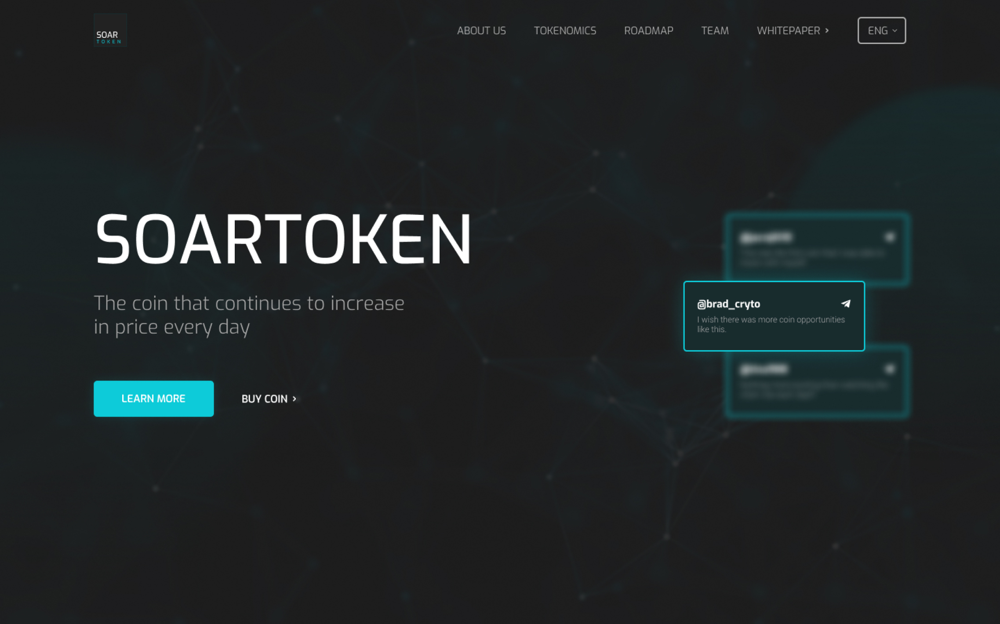
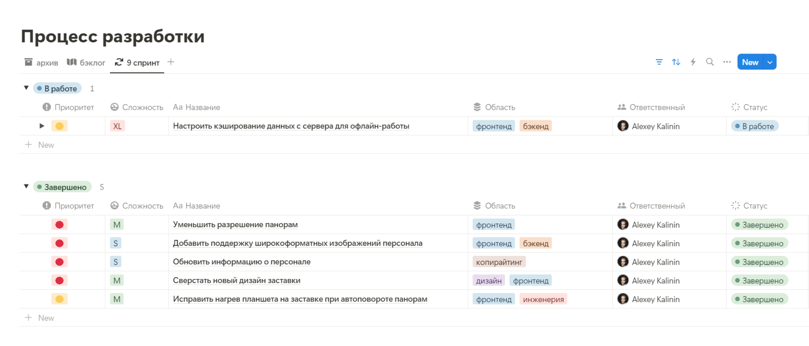

{/* todo: добавить зум к фото */}
{/* https://github.com/dimsemenov/photoswipe */}

{/* импорты */}

import ContentSection from '@/components/organisms/ContentSection.astro'
import AboutCard from '@/components/molecules/AboutCard.astro'
import Image from '@/components/atoms/Image.astro'
import H3 from '@/components/atoms/H3.astro'
import aboutVideoCover from './media/about-cover.jpg'
import aboutVideoMP4 from './media/about-video.mp4'
import aboutVideoWEBM from './media/about-video.webm'

export const components = { img: Image, h3: H3 }

{/* контент */}

<ContentSection title="Визитка">

<AboutCard mp4={aboutVideoMP4} webm={aboutVideoWEBM} poster={aboutVideoCover} />

---

### Что мне нравится

- Систематизировать данные
- Решать задачи с высокой степенью неопределенности
- Работать с доступностью интерфейсов

### Скиллы

- Самостоятельный
- Проактивный
- Мыслю системно и креативно
- Решаю задачи с высокой степенью неопределенности
- Говорю на одном языке с разработкой
- Эмпатичный
- Понимаю важность доступности
- Умею брать ответственность
- Умею слушать и слышать команду
- Понимаю ценности исследований

</ContentSection>

<ContentSection title="История">
### Раннее детство

С детства я любил разбираться, как устроена техника. В 3 года родители показали мне компьютер и это открыло для меня новый мир увлечений

Я много играл в Майнкрафт. Особенно мне нравились технические моды, где нужно было создавать схемы из механизмов и автоматизировать их. Это научило меня мыслить системно

Ещё мне нравилось играть на серверах, и я захотел создать свой. Проявив упорство, я смог это сделать. Так я впервые познакомился с программированием

### Верстка

Игры это круто, но в 9 классе я задумался о том, кем стану в будущем. Тогда я вспомнил, что раньше мне нравилось баловаться с созданием сайтов на конструкторах

Я захотел копнуть глубже и узнать, как сайты устроены изнутри. Cледующие 2 года я учил языки верстки и практиковал хорошие практики

Постепенно я начал понимать, что в наших реалиях одной верстки мало, и нужно выбирать, куда двигаться дальше: Фронтенд, Бэкенд или…

### Дизайн

Я выбрал его, потому что в верстке мне больше всего нравилось систематизировать информацию по блокам с помощью HTML, а затем стилизовать её через CSS. Ещё в душе горела творческая нотка и желание сделать понятно

Три года я учился дизайну: смотрел видео, читал статьи и книги, упорно практиковался

За время развития мы с другом создали [платформу для обмена рецептами блюд](https://sonniydesign.ru/projects/mamayapovar) и выиграли всероссийскую олимпиаду. Потом нашли первых клиентов и разработали проекты в сферах [medtech](https://sonniydesign.ru/projects/vtour) и [proptech](https://sonniydesign.ru/projects/nova-ug)

Во всех проектах я отвечал за менеджмент, дизайн и фронтенд. Изучал новые инструменты и оптимизировал процессы, чтобы мы работали быстрее

</ContentSection>
